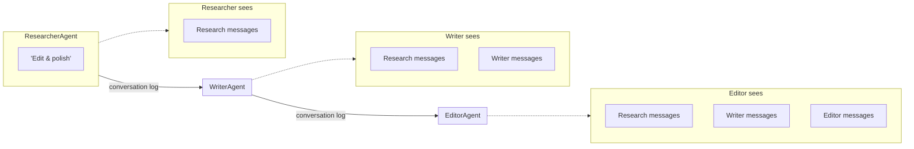

# Dapr .NET Agent Framework - Multi-Agent Shared History Demo

This example demonstrates a three-agent content pipeline where each agent sees the full conversation history from all prior agents. The workflow uses `RunAgentWithHistoryAsync` to pass a shared `List<WorkflowChatMessage>` through each step.

## What this demonstrates
- Shared conversation history across agents within a single workflow
- Agent-to-agent context flow: the writer sees the researcher's reasoning; the editor sees both
- Durable multi-agent orchestration: If the process crashes after the research phase, the writer and editor steps resume without re-executing the researcher

## Pipeline


## Prerequisites

- [.NET 8+](https://dotnet.microsoft.com/download) installed
- [Dapr CLI](https://docs.dapr.io/getting-started/install-dapr-cli/)
- [Initialized Dapr environment](https://docs.dapr.io/getting-started/installation)
- [Dapr .NET SDK](https://docs.dapr.io/developing-applications/sdks/dotnet/)
- [Ollama](https://ollama.com/) installed

## Running the example
From the `\examples` directory, start the Dapr runtime:

```sh
dapr run --app-id wfapp --dapr-grpc-port 50001 --dapr-http-port 3500 --resources-path "Components/"
```

Then run the app in another terminal with `dotnet run`. It listens on `http://localhost:5041`.

### Start the pipeline
Using a tool that can submit HTTP requests, send a POST request to `http://localhost:5041/pipeline` with the following body:
```json
{
  "topic": "The impact of large language models on software engineering practices"
}
```

Response:
```json
{
  "instanceId": "a1b2c3d4..."
}
```

To check the status, using your HTTP tool, send a GET request to `http://localhost:5041/status/<instanceId>` with your instance ID.

When the workflow is complete, the response will include the final edited article.

### When to use shared history
Shared history is best when:
- Later agents need to verify or cross-reference earlier agents' work
- The full reasoning chain matters (not just the final output)
- You want agents to build on each other's conversation rather than just their conclusions

## Next steps
See the `TranslationReviewDemo` example for a demonstration of a multi-agent workflow with isolated history or the `MultiTurnConversation` example demonstrating a single agent persisting a multi-turn conversation in a session. 