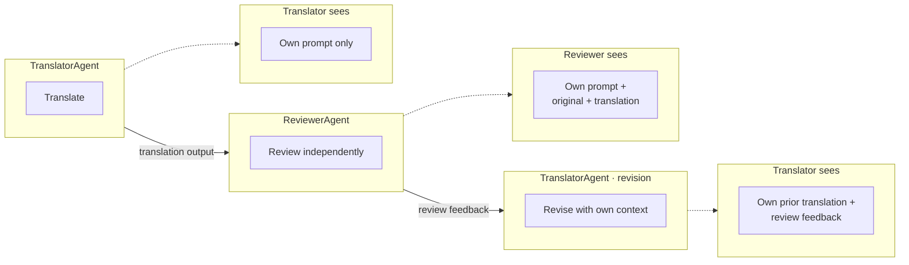

# Dapr .NET Agent Framework - Multi-Agent Isolated History Demo

This example demonstrates a multi-agent translation pipeline where each agent maintains its own isolated
conversation history. Unlike the shared history approach, agents don't see each other's internal researching. They
receive only explicit outputs from prior steps.

## What this demonstrates
- Per-agent conversation isolation: the reviewer doesn't see the translator's reasoning
- Multi-turn within a single agent: The translator is called twice (initial + revision) and the second calls sees its own prior translation for consistency
- Clean separation of concerns: each agent evaluates on its own merits
- Predictable token costs: agents only see their own history, not a growing shared log

## Pipeline


## Prerequisites

- [.NET 8+](https://dotnet.microsoft.com/download) installed
- [Dapr CLI](https://docs.dapr.io/getting-started/install-dapr-cli/)
- [Initialized Dapr environment](https://docs.dapr.io/getting-started/installation)
- [Dapr .NET SDK](https://docs.dapr.io/developing-applications/sdks/dotnet/)
- [Ollama](https://ollama.com/) installed

## Running the example
From the `\examples` directory, start the Dapr runtime:

```sh
dapr run --app-id wfapp --dapr-grpc-port 50001 --dapr-http-port 3500 --resources-path "Components/"
```

Then run the app in another terminal with `dotnet run`. It listens on `http://localhost:5041`.

### Start a translation
Using a tool that can submit HTTP requests, send a POST request to `http://localhost:5041/translate` with the following body:
```json
{
  "text": "The quick brown fox jumps over the lazy dog. This pangram contains every letter of the alphabet.",
  "sourceLanguage": "English",
  "targetLanguage": "French"
}
```

Response:
```json
{
  "instanceId": "a1b2c3d4..."
}
```

To check the status, using your HTTP tool, send a GET request to `http://localhost:5041/status/<instanceId>` with your instance ID.

When it's complete, the response will include the final translation and reviewer notes:
```json
{
  "status": "Completed",
  "result": {
    "sourceLanguage": "English",
    "targetLanguage": "French",
    "originalText": "The quick brown fox...",
    "translatedText": "Le rapide renard brun...",
    "reviewNotes": "The translation is accurate..."
  }
}
```

## When to use isolated history
Isolated history is best when:
- Agents should evaluate independently without being influenced by prior reasoning
- You want predictable token usage (each agent's context window only grows with its own turns history)
- An agent is called multiple times and needs consistency with its own prior outputs
- You need clean separation of concerns (e.g. reviewer shouldn't know how the translator arrived at its choices)

## Next steps
See the `ResearcherDemo` example for a demonstration of a multi-agent shared history workflow or the `MultiTurnConversation` example demonstrating a single agent persisting a multi-turn conversation in a session.